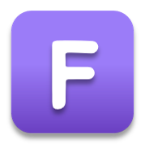
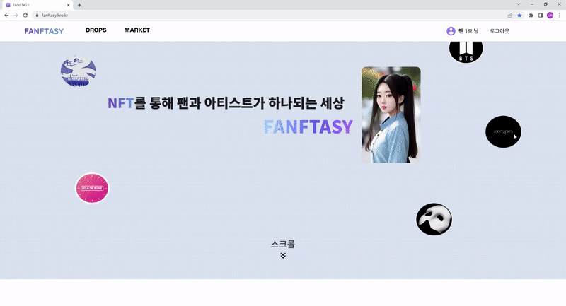
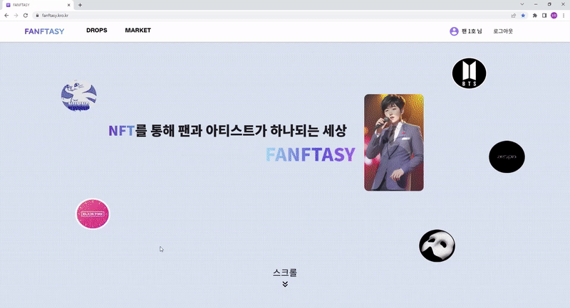
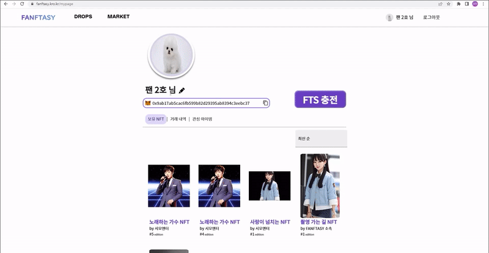

#  **FANFTASY**
### 팬과 아티스트를 위한 NFT 자유거래 플랫폼
---
## 🚀 **Overview**
블록체인 기술의 발전은 투명하고 안전하며 중개인을 통하지 않는 거래를 가능하게 합니다. 이와 더불어 NFT는 디지털 컨텐츠의 소유권이라는 새로운 개념의 디지털 자산으로 화두에 오르고 있습니다. 이런 요소들이 팬덤문화에 긍정적으로 활용될 수 있을 것이라는 기대에 해당 주제를 선정했습니다.

서비스를 통해 승인받은 아티스트는 이미지, 영상, 음성 컨텐츠에 해당하는 ERC721 기반의 NFT를 지정 수만큼 발행할 수 있습니다. 일반 사용자들은 이를 구매할 수도 있고, 구매한 NFT를 지정한 가격에 판매할 수 있는 플랫폼입니다.
## 📅 **프로젝트 진행 기간**
2022.02.20(월) ~ 2022.04.07(금)
## 📝 **주요 기능**
### Main Page
 

### 메타마스크 로그인
  

- 서비스 이용을 위해서 메타마스크가 필수이며, 설치되어 있지 않은 경우 설치 페이지로 이동합니다.
### 회원가입
  

- 최초 로그인의 경우, 메타마스크에서 네트워크 연결을 진행시키고 회원가입을 진행합니다.  
- 회원가입은 아티스트, 회원으로 구분됩니다.  
- 아티스트는 가입 직후 회원의 권한을 가지며, 서비스 관리자의 인증으로 권한이 변경됩니다.

### NFT 발행

- 아티스트는 ERC 721기반의 NFT를 발행할 수 있습니다.
- 사진, 영상, 음성 등의 컨텐츠를 업로드하고, 해당 컨텐츠의 발행 Edition 갯수를 설정할 수 있습니다.
- 발행 요청한 NFT는 서버를 통해 블록체인 네트워크에 생성됩니다.

### 발행된 NFT 조회

- 아티스트가 발행한 NFT들을 둘러볼 수 있습니다.
- 최신순, 판매 금액순, 잔여량 적은순으로 정렬이 가능하며 이름, 내용, 아티스트에 포함된 키워드로 검색할 수 있습니다.

### 발행된 NFT 구매

- NFT의 상세 정보를 볼 수 있습니다. 하트를 통해 관심 목록에 추가 할 수 있으며, 추가된 횟수를 나타냅니다.
- 아티스트가 발행한 NFT를 구매할 수 있습니다.
- 구매 시 메타마스크를 통해 서명하고 금액을 지불한 후, 소유권을 얻을 수 있습니다.
- 해당 컨텐츠의 Edition Number가 가장 낮은 NFT가 거래되면 잔여 수량에 반영됩니다.

### My page

- 회원 정보를 조회하고 수정할 수 있습니다.
- 보유한 NFT와 NFT상세 페이지에서 추가한 관심 목록을 확인할 수 있습니다.
- 보유한 NFT를 클릭하면, 상세 정보를 확인할 수 있습니다.

### 구매한 NFT 판매

- 구매한 NFT의 가격을 설정해서 판매할 수 있습니다.
- 판매 등록한 NFT는 Market 페이지에서 조회할 수 있으며, 발행된 NFT 구매와 동일하게 구매할 수 있습니다.

---

## 🛠️ 기술 스택

### Backend

- Spring boot 2.7.9
- JAVA 11
- JPA
- Spring Security
- MySQL
- Web3j

### FrontEnd

- Vue3
- Vuetify 3
- Web3.js
- Vuex
- Vue-router

### Block Chain

- Solidity
- OpenZeppelin

### CI/CD

- Jenkins
- Docker
- AWS EC2, AWS S3
- Nginx

---

## 📐 시스템 아키텍처

### 아키텍처

---

## 🧑‍🤝‍🧑 프로젝트 과정

- MatterMost
    - 의견 조율
- Gitlab
    - 코드 버전 관리 용도
- Notion
    - 프로젝트 정리
    - 회의록, 개발 컨벤션, 참고 문서 등 정리
        - 매일 아침마다 진행한 데일리 스크럼 결과 내용 정리
- JIRA
    - 매주 작업량 관리 용도

<aside>
🌲 master

- dev
    - dev-front
        - feature-front-기능명
        - feature-front-mainpage
    - dev-back
        - feature-back-기능명
    - fix : 문제가 생긴 브랜치에서 분기
        - fix-front-기능명
        - fix-back-기능명
- docs/문서타입[ex) README, ppt]
</aside>

브랜치 전략
- 젠킨스 배포를 위해 백, 프론트로 크게 브랜치를 나눔(dev-).
- dev-front, dev-back에서 각각 브랜치를 파서 작업 후, 완성한 기능은 머지.
- 문제가 생긴 브랜치에서 분기(fix-)해서 수정 후 정상화하면 머지(merge).

---

# ⛄ 프로젝트 인원

| 김성환 | 신선호 | 심호연 | 장근우 | 조민수 | 최현제 |
| --- | --- | --- | --- | --- | --- |
| Backend, Blockchain | Frontend | Frontend, Blockchain | Frontend | Backend | Backend |

---
